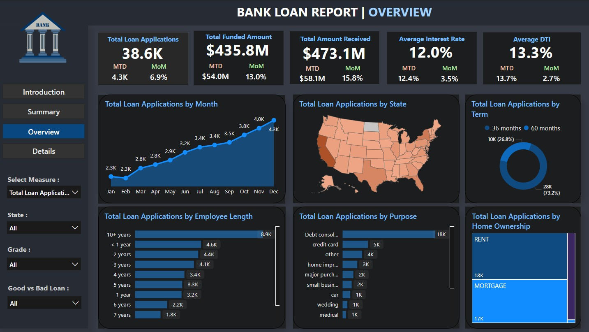
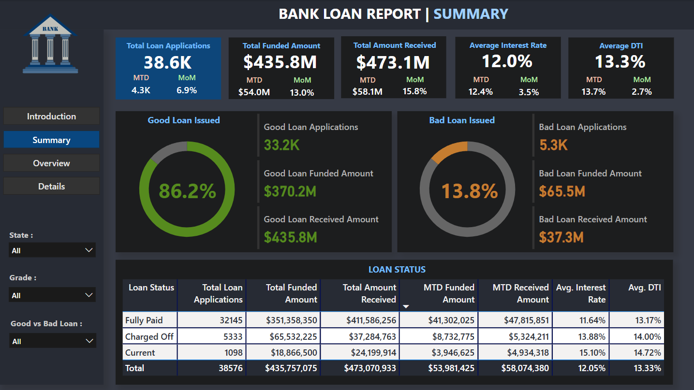
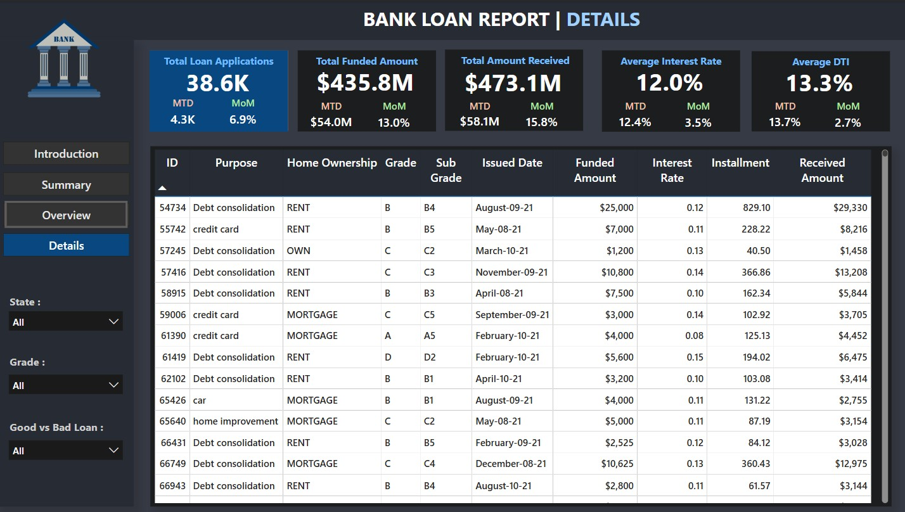

# Loan Data Analysis Dashboard

## 📌 Project Overview
**Problem Statement:**
Traditional loan data analysis methods lack depth and interactivity, making it difficult to derive meaningful insights for informed decision-making. Static reports fail to provide a comprehensive view of lending operations, borrower behavior, and loan performance metrics. This project addresses these limitations by developing advanced, interactive dashboards for enhanced loan data analysis.

**Objective:**
To create a suite of interconnected dashboards that deliver dynamic and comprehensive insights into loan data, empowering decision-makers with actionable intelligence. These dashboards provide a holistic perspective on lending operations, borrower demographics, loan performance, and financial metrics.

---

## 📊 Dashboards

### 1️⃣ Executive Summary Dashboard
**Purpose:**
Provides an overview of critical Key Performance Indicators (KPIs) essential for evaluating the efficiency and performance of lending operations.

**Key Features:**
- **Total Loan Applications:** Tracks total and Month-to-Date (MTD) applications, analyzing Month-over-Month (MoM) trends.
- **Total Funded Amount:** Monitors cumulative disbursed funds and MTD disbursements, identifying MoM variations.
- **Total Amount Received:** Assesses cash inflows via total and MTD received amounts, helping analyze financial health.
- **Average Interest Rate:** Computes and tracks the average lending rate across all loans, including MTD and MoM changes.
- **Average Debt-to-Income Ratio (DTI):** Evaluates borrowers' financial stability by monitoring the average DTI.

**Loan Performance Analysis:**
- Categorizes loans into **"Good"** and **"Bad"** based on key metrics.
- Implements a **Loan Status Grid View** for a detailed breakdown of loan statuses, supporting data-driven decisions.

📷 **Executive Summary Dashboard Preview:**  

---

### 2️⃣ Trends & Overview Dashboard
**Purpose:**
Offers interactive visualizations to highlight lending trends, borrower demographics, and loan purposes, helping identify patterns and opportunities.

**Key Visualizations:**
- **Monthly Trends by Issue Date (Line Chart):** Analyzes seasonality and long-term lending trends.
- **Regional Analysis by State (Filled Map):** Highlights key lending regions and geographical disparities.
- **Loan Term Analysis (Donut Chart):** Examines loan distribution by term length.
- **Employment Length Analysis (Bar Chart):** Assesses how employment history affects lending metrics.
- **Loan Purpose Breakdown (Bar Chart):** Visualizes financing needs across different categories.
- **Home Ownership Analysis (Tree Map):** Examines the impact of home ownership on loan approvals and disbursements.

📷 **Trends & Overview Dashboard Preview:**  

---

### 3️⃣ Detailed Insights Dashboard
**Purpose:**
Provides an in-depth look into loan data, allowing users to access key metrics and loan details for data-driven decision-making.

**Objective:**
The **Details Dashboard** offers a user-friendly platform for comprehensive loan portfolio analysis, improving informed lending decisions.

**Implementation Strategy:**
- Designed for **intuitive navigation** and seamless interaction.
- Incorporates **real-time data** for accurate, up-to-date analysis.
- Includes **user feedback mechanisms** for continuous improvement.

📷 **Detailed Insights Dashboard Preview:**  

---

## 🚀 Key Benefits
✅ Enhanced decision-making with dynamic, real-time data visualization.  
✅ Interactive and user-friendly interface for seamless exploration.  
✅ Improved loan performance tracking and borrower behavior analysis.  
✅ Strategic insights for optimizing lending operations and financial health.  

---

## 📌 Conclusion
By implementing these dashboards, we aim to optimize lending strategies, improve financial health, and enhance borrower satisfaction. The advanced visualizations and data-driven insights ensure better decision-making and operational efficiency.

🔹 **Developed with Power BI for advanced analytics.**  

---

## 📢 Get Involved
💬 **Feedback & Contributions:** Suggestions and enhancements
